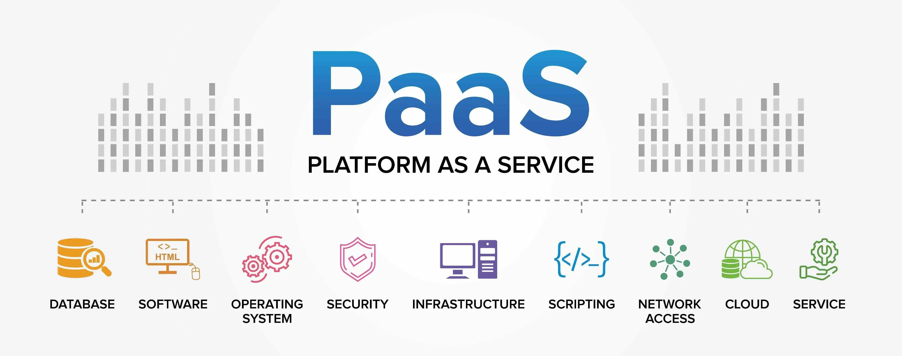
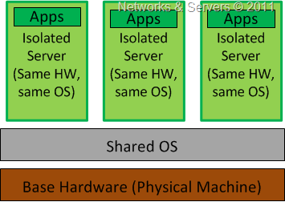
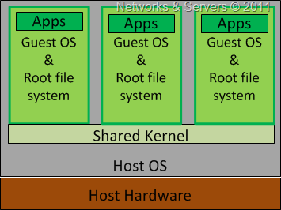
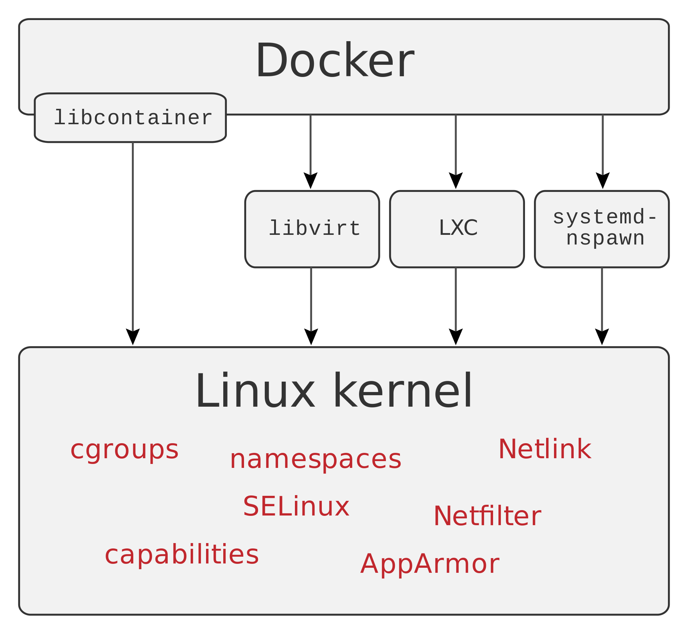
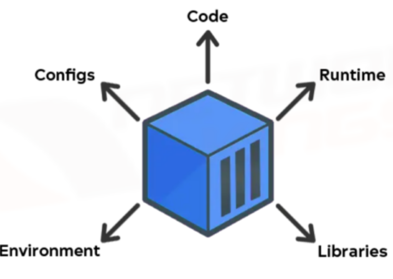
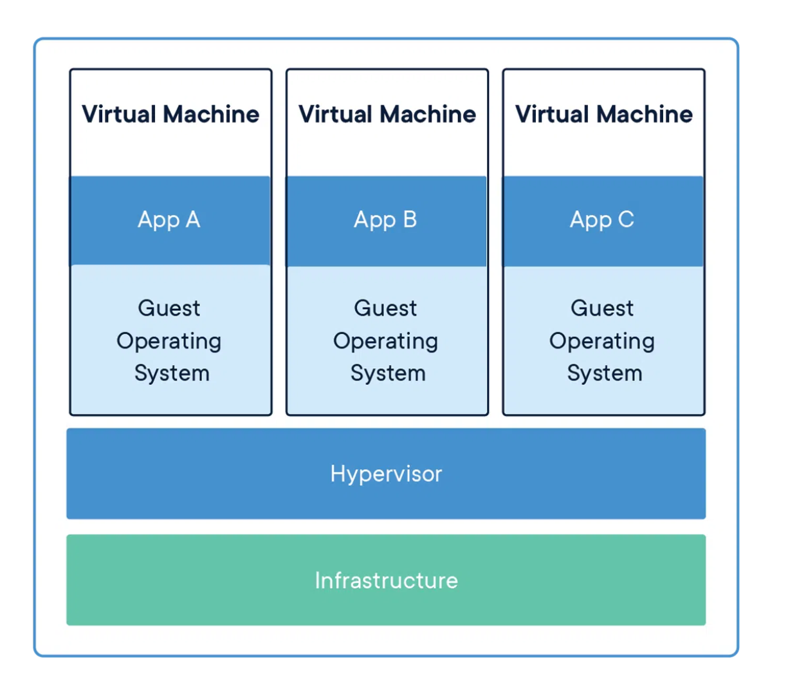
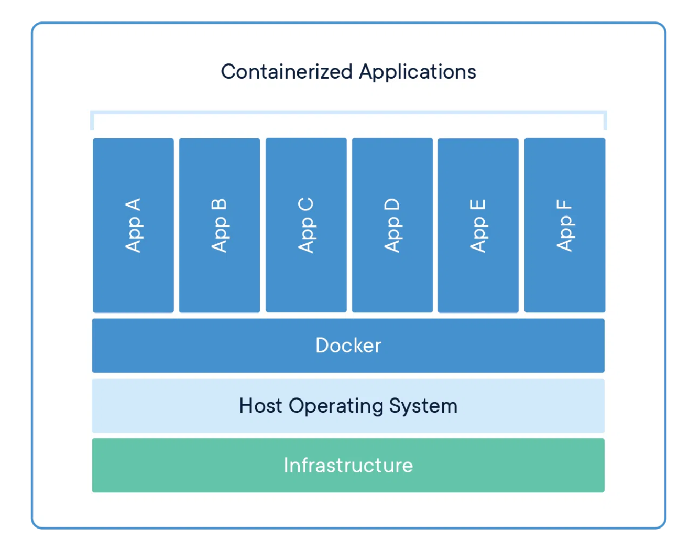
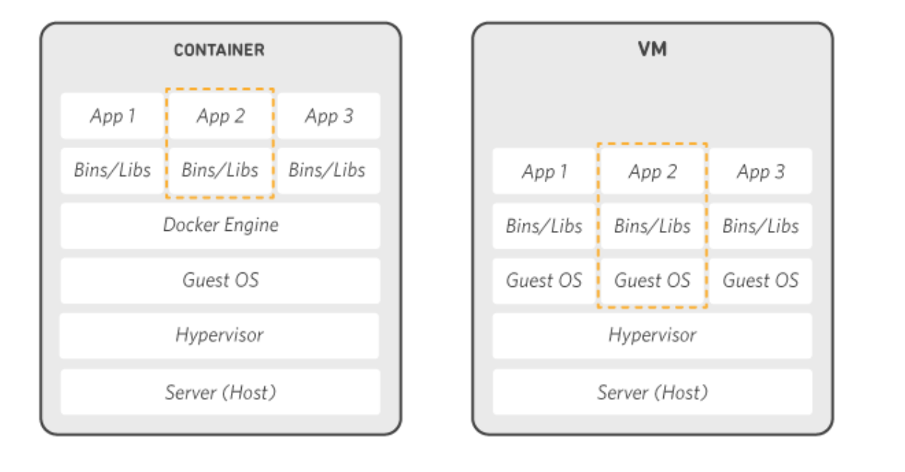
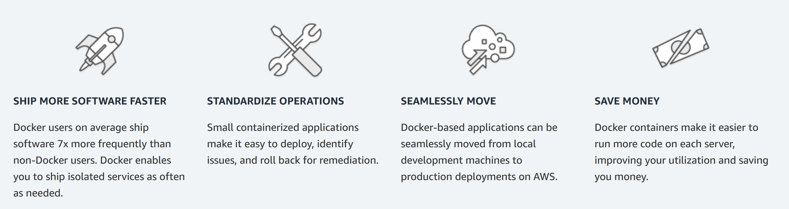
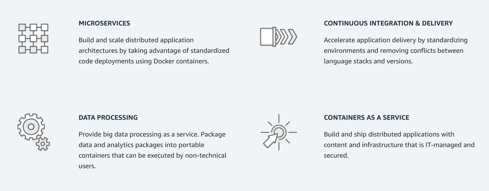

# Docker

Docker is a set of `platform as a service (PaaS)` products that use `OS-level virtualization`to deliver software in packages called `containers`.The service has both free and premium tiers. The software that hosts the containers is called `Docker Engine`. It was first released in `2013` and is developed by `Docker, Inc`.

Docker is a tool that is used to automate the deployment of applications in lightweight containers so that applications can work efficiently in different environments in isolation. 

# About PaaS

`Platform as a service (PaaS)` is a category of `cloud computing services` that allows customers to provision, instantiate, run, and manage a modular bundle comprising a computing platform and one or more applications, without the complexity of building and maintaining the infrastructure typically associated with developing and launching the application(s), and to allow developers to create, develop, and package such software bundles.

# About OS-level virtualization

server virtualization is a technique where the kernel of an operating system allows for multiple isolated user-space instances. These instances run on top of an existing host operating system and provide a set of libraries that applications interact with, giving them the illusion that they are running on a machine dedicated to its use. The instances are known as `Containers`, `Virtual Private Servers` or `Virtual Environments`. 

Operating system level virtualization is achieved by the host system running a single OS kernel and through its control of guest operating system functionality. Under this shared kernel virtualization the virtual guest systems each have their own root file system but share the kernel of the host operating system.

This is a special case of Hosted Virtualization where the hypervisor (the container) has very limited functionality, relying on the Host OS for CPU scheduling and memory management. If you prefer, this method, which uses virtualization at the OS level, doesn’t even include the use of a real hypervisor; instead, the virtualization capabilities are part of the hosting operating system, which performs all the functions of the hypervisor. 

In other words, OS level virtualization is based on the creation of isolated containers or partitions on a single physical server, and the use of OS instances for each guest application environment to work independently of the other partitions. With this technique, you install the virtualization software layer on top of the operating system and all of the guest systems run on top of this layer using the same operating system as the host OS but with each guest having its own resources and running in complete isolation from the other guests.

`NOTE` It can be argued that this is not virtualization in the strict sense of the term; rather a technique that just allows for machine consolidation.

Examples of OS level virtualization are Docker, OpenVZ, Virtuozzo, or Solaris Zones.

Docker can use different interfaces to access virtualization features of the Linux kernel.

#  Advantages of OS Level Virtualization

1. This form of virtualization usually imposes little or no overhead thereby ensuring most of the machine’s resources are available to the applications running in the containers

2. This is a cost-effective and efficient solution for creating similar guests, but it’s only practical for certain situations. It is an ideal approach for web hosting companies which have multiple virtual web servers running on a single box or blade. This is very convenient because patches or modifications can be made to the host server and they will instantly be applied to all of the containers. Another example would be a company that has to manage multiple SQL databases or any other scenario where many similar or identical servers need to be hosted or managed within the same datacenter.

#  Limitations of OS Level Virtualization 

This approach typically limits operating system choice. Containerization usually means that every guest OS must be identical or similar to the host in terms of version number and patch level. For example, with Linux as the host operating system, only Linux distributions can be run as the guest operating systems. This can cause problems if you want to run different applications in the containers, since applications are often certified for only a certain OS version and patch level. It is not possible for a Linux guest system designed for the 3.0.9 version of the kernel to share a 3.1.1 version kernel.

# About Containers

A container is a standard unit of software that packages up code and all its dependencies so the application runs quickly and reliably from one computing environment to another. A Docker container image is a lightweight, standalone, executable package of software that includes everything needed to run an application: code, runtime, system tools, system libraries and settings.

Container images become containers at runtime and in the case of Docker containers – images become containers when they run on Docker Engine. Available for both Linux and Windows-based applications, containerized software will always run the same, regardless of the infrastructure. Containers isolate software from its environment and ensure that it works uniformly despite differences for instance between development and staging.

Containers are isolated from one another and bundle their own software, libraries and configuration files; they can communicate with each other through well-defined channels. Because all of the containers share the services of a single operating system kernel, they use fewer resources than virtual machines.

# Virtual Machine Vs Containers

Containers and virtual machines have similar resource isolation and allocation benefits, but function differently because containers virtualize the operating system instead of hardware. Containers are more portable and efficient.

`Virtual Machine` ::: A virtual machine (VM) is a virtual environment that functions as a virtual computer system with its own CPU, memory, network interface, and storage, created on a physical hardware system (located off- or on-premises). Software called a hypervisor separates the machine’s resources from the hardware and provisions them appropriately so they can be used by the VM.
A `hypervisor` is software that creates and runs virtual machines (VMs).

The physical machines, equipped with a hypervisor such as Kernel-based Virtual Machine (KVM), is called the host machine, host computer, host operating system, or simply host. The many VMs that use its resources are guest machines, guest computers, guest operating systems, or simply guests. The hypervisor treats compute resources—like CPU, memory, and storage—as a pool of resources that can easily be relocated between existing guests or to new virtual machines.

VMs allow multiple different operating systems to run simultaneously on a single computer—like a Linux® distro on a MacOS laptop. Each operating system runs in the same way an operating system or application normally would on the host hardware, so the end user experience emulated within the VM is nearly identical to a real-time operating system experience running on a physical machine. 

--> Requires More Memory as it is itself an operating system that run on a host OS.

--> Startup time in minutes 

--> More Secure

so Virtual machines (VMs) are an abstraction of physical hardware turning one server into many servers. The hypervisor allows multiple VMs to run on a single machine. Each VM includes a full copy of an operating system, the application, necessary binaries and libraries – taking up tens of GBs. VMs can also be slow to boot.

`Containers` are an abstraction at the app layer that packages code and dependencies together. Multiple containers can run on the same machine and share the OS kernel with other containers, each running as isolated processes in user space. Containers take up less space than VMs (container images are typically tens of MBs in size), can handle more applications and require fewer VMs and Operating systems.

--> Portable docker images are esaily portable.

--> Requires Less Space[Memory]

--> Startup time in miliseconds

--> `Process Level Isolation` will discuss it one day...

# How Docker Works ?

Docker works by providing a standard way to run your code. Docker is an operating system for containers. Similar to how a virtual machine virtualizes (removes the need to directly manage) server hardware, containers virtualize the operating system of a server. Docker is installed on each server and provides simple commands you can use to build, start, or stop containers.

AWS services such as `AWS Fargate`, `Amazon ECS`, `Amazon EKS`, and `AWS Batch` make it easy to run and manage Docker containers at scale.

# Why to use Docker ?

Using Docker lets you ship code faster, standardize application operations, seamlessly move code, and save money by improving resource utilization. With Docker, you get a single object that can reliably run anywhere. Docker's simple and straightforward syntax gives you full control. Wide adoption means there's a robust ecosystem of tools and off-the-shelf applications that are ready to use with Docker.

# When to use Docker ?

You can use Docker containers as a core building block creating modern applications and platforms. Docker makes it easy to build and run `distributed microservices architecures`, `deploy your code with standardized continuous integration and delivery pipelines`, `build highly-scalable data processing systems`, and `create fully-managed platforms for your developers`. The recent collaboration between AWS and Docker makes it easier for you to deploy Docker Compose artifacts to `Amazon ECS` and `AWS Fargate`. 

# Refernces 

`https://www.zdnet.com/article/what-is-docker-and-why-is-it-so-darn-popular/`

